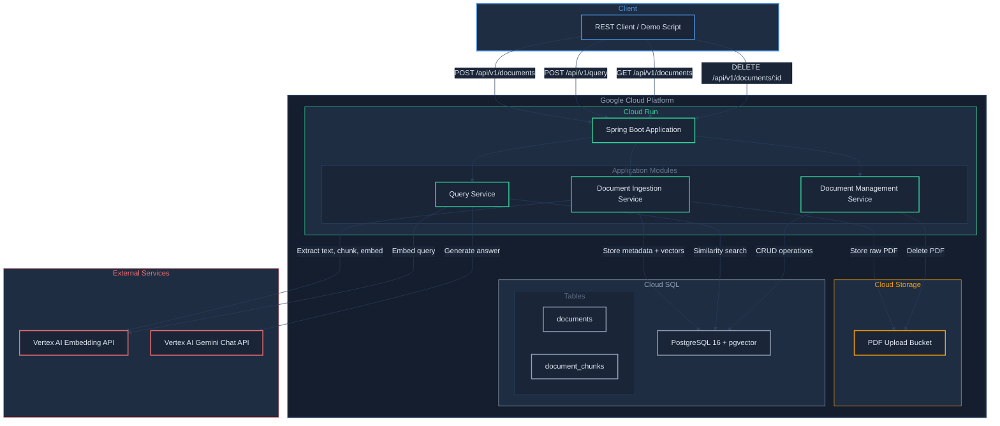

# Architecture -- Classroom Clarity RAG

## High-Level Service Architecture



### Flow Summary

There are two primary data flows:

**Document Ingestion Flow:**
1. Client uploads a PDF to the `/api/v1/documents` endpoint.
2. The application stores the raw PDF in Cloud Storage.
3. Text is extracted from the PDF using Apache PDFBox.
4. The extracted text is split into overlapping chunks (target ~512 tokens, ~100 token overlap).
5. Each chunk is sent to the Vertex AI text embedding API to generate a vector.
6. Document metadata is stored in the `documents` table; chunks and their embedding vectors are stored in the `document_chunks` table.

**Query Flow:**
1. Client sends a question to the `/api/v1/query` endpoint.
2. The question is embedded using the same Vertex AI embedding model.
3. A similarity search (cosine distance) is performed against `document_chunks` using pgvector.
4. The top-K most relevant chunks are retrieved.
5. The chunks are assembled into a context prompt alongside the original question.
6. The prompt is sent to Vertex AI Gemini for answer generation.
7. The response includes the generated answer and the source chunks with document references.

---

## Tech Stack

| Service / Concern | Technology | Version | Rationale |
|---|---|---|---|
| Runtime | Java | 21 (LTS) | Long-term support, strong Cloud Run compatibility, records and modern features |
| Framework | Spring Boot | 3.5.x | Active OSS release line; required by Spring AI 1.1.x; mature ecosystem |
| AI Framework | Spring AI | 1.1.x | GA release with RetrievalAugmentationAdvisor, built-in pgvector VectorStore, Vertex AI chat/embedding clients, enhanced Advisors API |
| Build Tool | Gradle (Kotlin DSL) | 9.x | Convention-over-configuration, strong Spring Boot plugin support |
| PDF Extraction | Apache PDFBox | 3.0.6 | Mature, pure-Java PDF text extraction |
| Database | Cloud SQL for PostgreSQL | PostgreSQL 16 | Managed PostgreSQL with automatic backups and IAM authentication |
| Vector Search | pgvector | 0.8.0 | Open-source vector similarity search for PostgreSQL; HNSW index support |
| Object Storage | Google Cloud Storage | -- | Durable storage for raw uploaded PDFs; managed via `com.google.cloud:libraries-bom` |
| Embedding Model | Vertex AI text-embedding-005 | -- | Google-hosted embedding model; 768 dimensions; no API key management needed with Workload Identity |
| Chat Model | Vertex AI Gemini 3.1 Flash-Lite | preview | Fast, cost-effective generative model suitable for grounded Q&A |
| Containerization | Docker (Jib) | -- | Jib builds optimized container images without a Dockerfile |
| Deployment | Google Cloud Run | v2 | Serverless container hosting; scales to zero; IAM-integrated |
| Database Migrations | Flyway | 11.x | Version-controlled schema migrations, managed by Spring Boot BOM |
| Testing | Testcontainers | 2.0.x | Integration testing with containerized PostgreSQL + pgvector |

---

## Key Design Decisions and Trade-offs

### 1. pgvector on Cloud SQL vs. Firebase Data Connect

**Decision:** Use Cloud SQL for PostgreSQL with pgvector.

**Rationale:**
- pgvector provides native vector similarity search with HNSW indexing directly in PostgreSQL, avoiding a separate vector database service.
- Cloud SQL offers managed backups, IAM authentication, and private IP connectivity to Cloud Run.
- Firebase Data Connect is newer and does not yet offer mature vector search capabilities.
- Using a single PostgreSQL instance for both relational data (document metadata) and vector data (embeddings) simplifies the architecture.
- Spring AI 1.1.x provides `spring-ai-starter-vector-store-pgvector` which handles pgvector integration out of the box.

**Trade-off:** Cloud SQL has a minimum cost even when idle (unlike Firebase's pay-per-use model). Acceptable for a portfolio project.

### 2. Vertex AI vs. OpenAI for Embeddings and Chat

**Decision:** Use Vertex AI (text-embedding-005 and Gemini 3.1 Flash-Lite).

**Rationale:**
- Keeps the entire stack within GCP, simplifying authentication (Workload Identity, no separate API keys).
- Demonstrates GCP-native AI integration, which is relevant for enterprise audiences.
- Spring AI 1.1.x has first-class Vertex AI support via `spring-ai-starter-model-vertex-ai-gemini`, including the enhanced Advisors API and RetrievalAugmentationAdvisor for modular RAG pipelines.

**Trade-off:** Vertex AI embedding models have fewer dimension options than OpenAI's. The 768-dimension output from text-embedding-005 is sufficient for this use case.

### 3. Chunking Strategy

**Decision:** Fixed-size token-based chunking with overlap.

**Rationale:**
- Simple to implement and reason about.
- Overlap (100 tokens) ensures context is not lost at chunk boundaries.
- Target chunk size of ~512 tokens balances retrieval precision with context completeness.

**Trade-off:** Semantic chunking (splitting by section headers or paragraphs) could yield better retrieval quality for structured documents. This can be explored as a future enhancement.

### 4. Embedding Dimensions and Indexing

**Decision:** 768-dimension vectors with HNSW indexing.

**Rationale:**
- text-embedding-005 outputs 768-dimension vectors.
- HNSW (Hierarchical Navigable Small World) indexing provides fast approximate nearest neighbor search with good recall.
- pgvector 0.8.0 supports HNSW natively.

**Trade-off:** HNSW indexes consume more memory than IVFFlat but provide consistently better query latency. For the expected data volume (hundreds to low thousands of chunks), this is well within Cloud SQL resource limits.

---

## Project Source Code Structure

```
classroom-clarity-rag/
|-- build.gradle.kts
|-- settings.gradle.kts
|-- Dockerfile                          # Fallback; prefer Jib for builds
|-- src/
|   |-- main/
|   |   |-- java/com/jkingai/classroomclarity/
|   |   |   |-- ClassroomClarityApplication.java        # Spring Boot entry point
|   |   |   |-- config/
|   |   |   |   |-- AiConfig.java                       # Spring AI beans (ChatClient, EmbeddingModel, VectorStore, RetrievalAugmentationAdvisor)
|   |   |   |   |-- StorageConfig.java                  # Cloud Storage client bean
|   |   |   |-- controller/
|   |   |   |   |-- DocumentController.java             # REST endpoints for document CRUD
|   |   |   |   |-- QueryController.java                # REST endpoint for Q&A queries
|   |   |   |   |-- HealthController.java               # Health check endpoint
|   |   |   |-- service/
|   |   |   |   |-- DocumentIngestionService.java       # Orchestrates PDF upload, extraction, chunking, embedding
|   |   |   |   |-- PdfExtractionService.java           # Extracts text from PDFs using PDFBox
|   |   |   |   |-- ChunkingService.java                # Splits text into overlapping token-based chunks
|   |   |   |   |-- QueryService.java                   # Orchestrates query embedding, retrieval, and answer generation
|   |   |   |   |-- DocumentManagementService.java      # List and delete documents
|   |   |   |-- model/
|   |   |   |   |-- Document.java                       # JPA entity for document metadata
|   |   |   |   |-- DocumentChunk.java                  # JPA entity for chunks with embedding vectors
|   |   |   |-- repository/
|   |   |   |   |-- DocumentRepository.java             # Spring Data JPA repository
|   |   |   |   |-- DocumentChunkRepository.java        # Spring Data JPA repository with custom vector search query
|   |   |   |-- dto/
|   |   |   |   |-- DocumentUploadResponse.java         # Response DTO for document upload
|   |   |   |   |-- QueryRequest.java                   # Request DTO for Q&A
|   |   |   |   |-- QueryResponse.java                  # Response DTO for Q&A with citations
|   |   |   |   |-- DocumentSummary.java                # Response DTO for document listing
|   |   |   |   |-- ErrorResponse.java                  # Standard error response DTO
|   |   |   |-- exception/
|   |   |       |-- GlobalExceptionHandler.java         # @ControllerAdvice for consistent error responses
|   |   |       |-- DocumentNotFoundException.java
|   |   |       |-- DocumentProcessingException.java
|   |   |-- resources/
|   |       |-- application.yml                         # Main configuration
|   |       |-- application-local.yml                   # Local dev overrides
|   |       |-- application-prod.yml                    # Production (Cloud Run) overrides
|   |       |-- db/migration/
|   |           |-- V1__create_documents_table.sql
|   |           |-- V2__create_document_chunks_table.sql
|   |           |-- V3__create_hnsw_index.sql
|   |-- test/
|       |-- java/com/jkingai/classroomclarity/
|           |-- service/
|           |   |-- ChunkingServiceTest.java
|           |   |-- DocumentIngestionServiceTest.java
|           |   |-- QueryServiceTest.java
|           |-- controller/
|           |   |-- DocumentControllerTest.java
|           |   |-- QueryControllerTest.java
|           |-- integration/
|               |-- IngestionIntegrationTest.java       # Uses Testcontainers for PostgreSQL + pgvector
|               |-- QueryIntegrationTest.java
```
