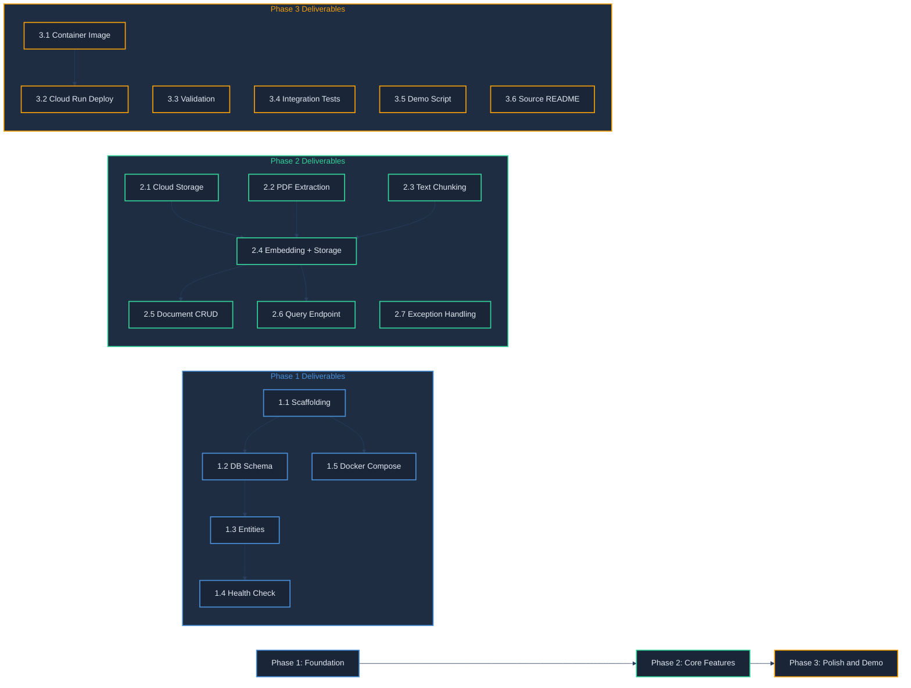

# Milestones -- Classroom Clarity RAG

This document defines three development phases with concrete deliverables and acceptance criteria. Each phase builds on the previous one. An AI agent or developer should be able to execute against these milestones using the companion documents (architecture.md and api-contracts.md) as references.

---

## Phase 1: Foundation ✅ COMPLETE

**Goal:** Project scaffolding, core dependencies wired, database schema in place, and a deployable (but mostly empty) application running locally.

**Estimated Effort:** 1-2 days

### Deliverables

#### 1.1 Project Scaffolding

- [x] Initialize a Spring Boot 3.5.x project using Gradle (Kotlin DSL) with Java 21.
- [x] Configure the following dependencies in `build.gradle.kts`:
  - `spring-boot-starter-web`
  - `spring-boot-starter-data-jpa`
  - `spring-boot-starter-validation`
  - `spring-boot-starter-actuator`
  - `spring-ai-starter-model-vertex-ai-gemini` (via Spring AI BOM 1.1.x)
  - `spring-ai-starter-vector-store-pgvector` (via Spring AI BOM 1.1.x)
  - `org.apache.pdfbox:pdfbox` (3.0.6)
  - `com.google.cloud:google-cloud-storage` (via `com.google.cloud:libraries-bom`)
  - `org.flywaydb:flyway-core` and `org.flywaydb:flyway-database-postgresql` (managed by Spring Boot BOM)
  - `org.postgresql:postgresql` (runtime)
  - Test dependencies: `spring-boot-starter-test`, `org.testcontainers:testcontainers-postgresql`, `org.testcontainers:testcontainers-junit-jupiter` (via Testcontainers BOM 2.0.x)
- [x] Create the package structure as defined in architecture.md.
- [x] Configure `application.yml` with profiles for `local` and `prod`.

**Acceptance Criteria:**
- `./gradlew build` completes successfully (compilation, no test failures).
- The application starts locally with `./gradlew bootRun` using the `local` profile.

#### 1.2 Database Schema and Migrations

- [x] Write Flyway migration `V1__create_documents_table.sql` to create the `documents` table as specified in api-contracts.md.
- [x] Write Flyway migration `V2__create_document_chunks_table.sql` to create the `document_chunks` table with the `vector(768)` column.
- [x] Write Flyway migration `V3__create_hnsw_index.sql` to create the HNSW index on the embedding column.
- [x] Ensure `CREATE EXTENSION IF NOT EXISTS vector;` runs before table creation (can be in V1 or a V0 migration).

**Acceptance Criteria:**
- A local PostgreSQL instance with pgvector starts via Docker Compose or Testcontainers.
- Flyway migrations run on application startup and create both tables and the HNSW index.
- `\dt` in psql shows `documents` and `document_chunks` tables.
- `\dx` in psql shows the `vector` extension is enabled.

#### 1.3 JPA Entities and Repositories

- [x] Create `Document` JPA entity mapped to the `documents` table.
- [x] Create `DocumentChunk` JPA entity mapped to the `document_chunks` table. The `embedding` field should be mapped as `float[]` (Spring AI's pgvector store handles the vector type conversion).
- [x] Create `DocumentRepository` extending `JpaRepository<Document, UUID>`.
- [x] Create `DocumentChunkRepository` extending `JpaRepository<DocumentChunk, UUID>` with a custom `@Query` method for similarity search.

**Acceptance Criteria:**
- Unit tests verify entity mapping (save and retrieve a `Document`, save and retrieve a `DocumentChunk`).
- The custom similarity search query compiles and is syntactically valid.

#### 1.4 Health Check Endpoint

- [x] Implement `GET /api/v1/health` as specified in api-contracts.md.
- [x] The endpoint checks database connectivity, and returns status for each component.
- [x] Embedding model and chat model checks can return `UNKNOWN` until those integrations are wired in Phase 2.

**Acceptance Criteria:**
- `curl http://localhost:8080/api/v1/health` returns a 200 response with `database.status: UP` when PostgreSQL is running.
- Returns 503 with `database.status: DOWN` when PostgreSQL is unreachable.

#### 1.5 Docker Compose for Local Development

- [x] Create a `docker-compose.yml` with a PostgreSQL 16 service that has pgvector pre-installed (use `pgvector/pgvector:pg16` image).
- [x] Map port 5432 and configure default credentials matching `application-local.yml`.

**Acceptance Criteria:**
- `docker compose up -d` starts PostgreSQL with pgvector.
- The Spring Boot application connects to it and runs migrations on startup.

---

**Phase 1 Dependencies:** None. This is the starting phase.

---

## Phase 2: Core Features ✅ COMPLETE

**Goal:** Full ETL pipeline (upload, extract, chunk, embed, store) and semantic search Q&A working end-to-end.

**Estimated Effort:** 3-5 days

**Depends on:** Phase 1 complete (schema, entities, health check all working).

### Deliverables

#### 2.1 Cloud Storage Integration

- [x] Create `StorageConfig.java` to configure a `Storage` bean for Google Cloud Storage.
- [x] Implement file upload logic: accept a `MultipartFile`, validate it is a PDF and under 50 MB, and upload it to a configured Cloud Storage bucket under a path like `documents/{documentId}/{filename}`.
- [x] Implement file deletion logic: delete the object from Cloud Storage given a storage path.
- [x] For local development, use a fake/local GCS emulator or simply store files to a local directory (configurable via profile).

**Acceptance Criteria:**
- A PDF file can be uploaded to the configured storage location.
- A stored PDF can be deleted.
- The `local` profile stores files to a local directory without requiring GCP credentials.

#### 2.2 PDF Text Extraction

- [x] Implement `PdfExtractionService` using Apache PDFBox.
- [x] Extract text page-by-page from a PDF `InputStream`.
- [x] Return a structured result containing the full text, per-page text, and the total page count.
- [x] Handle common PDF issues: encrypted PDFs (reject with a clear error), scanned/image-only PDFs (detect and warn that OCR is not supported).

**Acceptance Criteria:**
- A multi-page PDF produces extracted text with correct page number attribution.
- An encrypted PDF returns an appropriate error.
- A unit test verifies extraction against a sample PDF file in `src/test/resources/`.

#### 2.3 Text Chunking

- [x] Implement `ChunkingService` that splits extracted text into chunks.
- [x] Target chunk size: approximately 512 tokens (use a simple whitespace-based token approximation: ~4 characters per token).
- [x] Overlap: approximately 100 tokens between consecutive chunks.
- [x] Each chunk retains its source page number (or page range if it spans pages).
- [x] Each chunk has a `chunkIndex` indicating its position in the document.

**Acceptance Criteria:**
- A 5000-word document produces roughly 10-12 chunks (depending on exact token boundaries).
- Consecutive chunks overlap by approximately 100 tokens.
- Each chunk carries the correct page number.
- Unit tests verify chunk count, overlap presence, and page attribution.

#### 2.4 Embedding Generation and Storage

- [x] Configure Spring AI's Vertex AI embedding client to use `text-embedding-005`.
- [x] In `DocumentIngestionService`, orchestrate the full pipeline: receive uploaded file -> store in Cloud Storage -> extract text -> chunk text -> generate embeddings for each chunk -> store `Document` and `DocumentChunk` records in PostgreSQL.
- [x] Set `document.status` to `PROCESSING` at the start, `COMPLETED` on success, `FAILED` on error.
- [x] Update `document.chunk_count` and `document.page_count` after processing.

**Acceptance Criteria:**
- Uploading a PDF via `POST /api/v1/documents` triggers the full pipeline and returns a `201 Created` response with `status: COMPLETED`.
- The `documents` table has one row with correct metadata.
- The `document_chunks` table has rows with non-null 768-dimension embedding vectors.
- The HNSW index is used by the similarity search query (verify with `EXPLAIN ANALYZE`).

#### 2.5 Document Management Endpoints

- [x] Implement `GET /api/v1/documents` with pagination as specified in api-contracts.md.
- [x] Implement `GET /api/v1/documents/{id}` returning a single document.
- [x] Implement `DELETE /api/v1/documents/{id}` which deletes the document row (cascading to chunks), and deletes the PDF from Cloud Storage.
- [x] Return 404 with the standard error format for unknown document IDs.

**Acceptance Criteria:**
- After uploading two documents, `GET /api/v1/documents` returns both with correct metadata.
- `GET /api/v1/documents/{id}` returns a single document.
- `DELETE /api/v1/documents/{id}` removes the document, its chunks, and the stored PDF.
- Requesting a deleted document returns 404.

#### 2.6 Semantic Query Endpoint

- [x] Implement `QueryService` that: embeds the user's question using the same embedding model, performs a similarity search using the custom repository query, filters results by `similarityThreshold`, optionally filters by `documentIds`, retrieves the top-K chunks.
- [x] Build a prompt that includes the retrieved chunks as context and the user's question, then send it to Vertex AI Gemini 3.1 Flash-Lite via Spring AI's `ChatClient`. Consider using Spring AI 1.1's `RetrievalAugmentationAdvisor` for a modular RAG pipeline.
- [x] The prompt template should instruct the model to: answer based only on the provided context, cite which document and section the answer comes from, and say "I don't have enough information to answer that question" if the context is insufficient.
- [x] Implement `POST /api/v1/query` as specified in api-contracts.md.

**Acceptance Criteria:**
- After ingesting a sample handbook PDF, `POST /api/v1/query` with a relevant question returns a grounded answer with source citations.
- The `sources` array in the response includes `documentId`, `documentTitle`, `content`, `pageNumber`, and `similarityScore`.
- A question about a topic not in any document returns the 422 `NO_RELEVANT_CONTEXT` response (or an answer stating insufficient information if some chunks are retrieved but the model cannot answer).
- The `metadata.processingTimeMs` field reflects actual processing time.

#### 2.7 Global Exception Handling

- [x] Implement `GlobalExceptionHandler` using `@ControllerAdvice`.
- [x] Map `DocumentNotFoundException` to 404.
- [x] Map `DocumentProcessingException` to 500 with `PROCESSING_FAILED`.
- [x] Map `MethodArgumentNotValidException` to 400 with `VALIDATION_ERROR`.
- [x] Map generic exceptions to 500 with a safe message (no stack traces in the response).
- [x] All error responses follow the standard format from api-contracts.md.

**Acceptance Criteria:**
- Invalid requests return properly formatted error JSON.
- Unknown endpoints return 404 (not a Spring Boot whitelabel page).
- Exceptions during processing return 500 with a safe message, and full details are logged server-side.

---

## Phase 3: Polish and Demo

**Goal:** Production-readiness improvements, deployment to Cloud Run, and a working demo script.

**Estimated Effort:** 2-3 days

**Depends on:** Phase 2 complete (end-to-end ingestion and query working).

### Deliverables

#### 3.1 Container Image with Jib

- [ ] Add the Jib Gradle plugin to build a container image without a Dockerfile.
- [ ] Configure the image to use `eclipse-temurin:21-jre` as the base image.
- [ ] Configure the image name to target Artifact Registry: `{region}-docker.pkg.dev/{project-id}/classroom-clarity/api`.
- [ ] Verify the image builds and runs locally: `./gradlew jibDockerBuild && docker run -p 8080:8080 ...`.

**Acceptance Criteria:**
- `./gradlew jibDockerBuild` produces a local Docker image.
- The image starts and the health endpoint responds.

#### 3.2 Cloud Run Deployment Configuration

- [ ] Create a Cloud Run service configuration (either a `service.yaml` or a shell script using `gcloud run deploy`).
- [ ] Configure environment variables for the `prod` profile: database connection (via Cloud SQL Auth Proxy sidecar or direct Private IP), GCP project ID, Cloud Storage bucket name.
- [ ] Configure the service with: 1 GiB memory minimum (PDF processing needs headroom), request timeout of 300 seconds (large PDFs may take time to process), concurrency of 80, min instances of 0 (scale to zero).
- [ ] Set up the Cloud SQL connection using the Cloud Run VPC connector or Cloud SQL Auth Proxy sidecar.

**Acceptance Criteria:**
- The application deploys to Cloud Run and starts successfully.
- `curl https://{cloud-run-url}/api/v1/health` returns `status: UP` with all components healthy.

#### 3.3 Request Validation and Hardening

- [ ] Add `@Valid` annotations and Bean Validation constraints to all request DTOs.
- [ ] Enforce file size limit (50 MB) on the document upload endpoint.
- [ ] Add rate limiting or request size limits at the Cloud Run level.
- [ ] Add request logging with correlation IDs using MDC (Mapped Diagnostic Context).
- [ ] Ensure no sensitive data (GCP credentials, internal errors) leaks in API responses.

**Acceptance Criteria:**
- Uploading a file larger than 50 MB returns `FILE_TOO_LARGE` error.
- Submitting a query with a blank question returns `VALIDATION_ERROR`.
- All requests are logged with a correlation ID.
- Error responses never contain stack traces or internal paths.

#### 3.4 Integration Tests

- [ ] Write integration tests using Testcontainers for PostgreSQL with pgvector.
- [ ] `IngestionIntegrationTest`: uploads a sample PDF and verifies documents and chunks are persisted correctly.
- [ ] `QueryIntegrationTest`: ingests a document, then queries it and verifies the response structure (note: this requires a mock or real embedding/chat model; use Spring AI's test utilities or mock the AI clients).
- [ ] Ensure tests run in CI without external dependencies (all services are containerized).

**Acceptance Criteria:**
- `./gradlew test` passes with all integration tests green.
- Tests do not require external GCP credentials (AI services are mocked for integration tests).

#### 3.5 Demo Script and Sample Data

- [ ] Create a `demo/` directory with:
  - A sample PDF document (a short, fictional school handbook -- 5-10 pages).
  - A `demo.sh` shell script that: starts the application (or assumes it is running), uploads the sample PDF, waits for processing to complete, runs 3-5 curated questions and prints the answers, deletes the document.
- [ ] The demo script should use `curl` and `jq` for readable output.

**Acceptance Criteria:**
- Running `./demo/demo.sh` against a running instance completes without errors.
- Each question receives a grounded answer that references the uploaded document.
- The demo takes under 2 minutes to run end-to-end.

#### 3.6 Project README (Source Code)

- [ ] Create a README.md in the application source root (`classroom-clarity-rag/`) with:
  - Project description and purpose.
  - Prerequisites (Java 21, Docker, GCP project).
  - Local development setup instructions.
  - How to run tests.
  - How to deploy to Cloud Run.
  - API usage examples.

**Acceptance Criteria:**
- A developer can follow the README to set up, run, and test the project from scratch.

---

## Milestone Dependency Graph

---

## Summary Table

| Phase | Deliverables | Depends On | Effort |
|-------|-------------|------------|--------|
| Phase 1: Foundation | Scaffolding, DB schema, entities, health check, Docker Compose | None | 1-2 days |
| Phase 2: Core Features | Storage, PDF extraction, chunking, embedding, document CRUD, query endpoint, error handling | Phase 1 | 3-5 days |
| Phase 3: Polish and Demo | Container image, Cloud Run deploy, validation, integration tests, demo script, README | Phase 2 | 2-3 days |
| **Total** | **19 deliverables** | | **6-10 days** |
