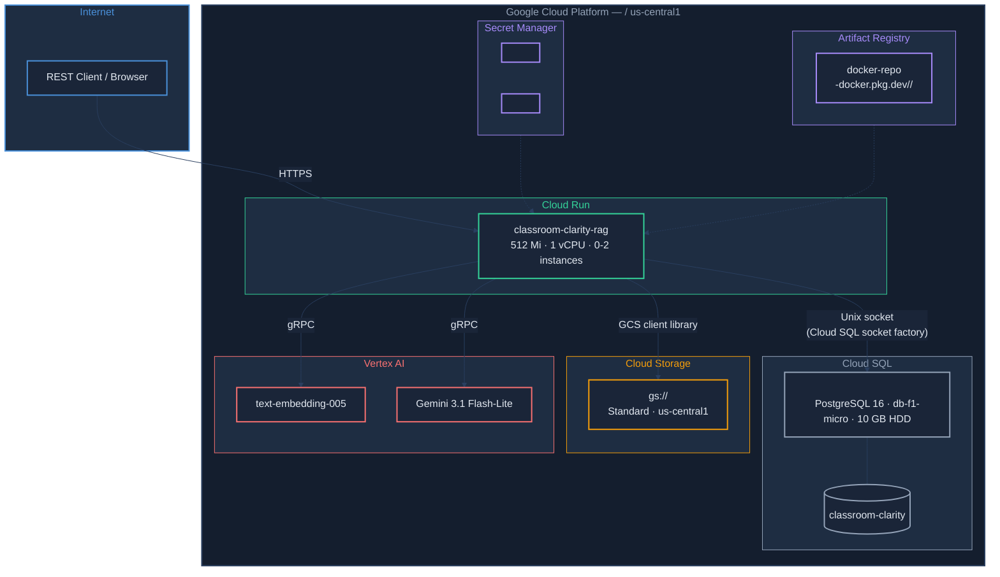

# Production Deployment — Classroom Clarity RAG

How to deploy and operate the application on Google Cloud Platform.

---

## Physical Architecture



### Key Connections

| From | To | Method |
|------|----|--------|
| Cloud Run → Cloud SQL | Unix socket via `postgres-socket-factory` (no Auth Proxy sidecar) |
| Cloud Run → GCS | `google-cloud-storage` client library with ADC |
| Cloud Run → Vertex AI | Spring AI gRPC clients with ADC |
| Cloud Run ← Secrets | Mounted as environment variables at container startup |

---

## GCP Resources

| Resource | Name / ID | Spec |
|----------|-----------|------|
| **Project** | `<YOUR_GCP_PROJECT>` | |
| **Region** | `us-central1` | All resources colocated |
| **Cloud Run service** | `classroom-clarity-rag` | 512 Mi, 1 vCPU, 0-2 instances, scale-to-zero |
| **Cloud SQL instance** | `<YOUR_CLOUD_SQL_INSTANCE>` | PG 16, `db-f1-micro`, 10 GB HDD, Enterprise edition |
| **Database** | `classroom-clarity` | Within `<YOUR_CLOUD_SQL_INSTANCE>` |
| **GCS bucket** | `gs://<YOUR_GCS_BUCKET>` | Standard class, uniform bucket-level access |
| **Artifact Registry** | `docker-repo` | Docker format, `us-central1` |
| **Service account** | `<YOUR_SERVICE_ACCOUNT>@<YOUR_GCP_PROJECT>.iam.gserviceaccount.com` | Cloud Run runtime identity |
| **Secrets** | `<YOUR_API_KEY_SECRET>`, `<YOUR_DB_PASSWORD_SECRET>` | Latest version mounted as env vars |

### Service Account IAM Roles

| Role | Purpose |
|------|---------|
| `roles/aiplatform.user` | Call Vertex AI embedding and chat models |
| `roles/cloudsql.client` | Connect to Cloud SQL via socket factory |
| `roles/storage.objectAdmin` | Read/write/delete PDFs in GCS |
| `roles/secretmanager.secretAccessor` | Read secrets (bound per-secret, not project-wide) |

---

## Cloud Run Configuration

### Environment Variables

| Variable | Value | Source |
|----------|-------|--------|
| `SPRING_PROFILES_ACTIVE` | `prod` | Env var (set in container image by Jib, or as runtime env var for source deploys) |
| `DATABASE_URL` | `jdbc:postgresql:///classroom-clarity?cloudSqlInstance=<YOUR_GCP_PROJECT>:us-central1:<YOUR_CLOUD_SQL_INSTANCE>&socketFactory=com.google.cloud.sql.postgres.SocketFactory` | Env var |
| `DATABASE_USERNAME` | `postgres` | Env var |
| `DATABASE_PASSWORD` | *(from Secret Manager)* | Secret: `<YOUR_DB_PASSWORD_SECRET>:latest` |
| `API_KEY` | *(from Secret Manager)* | Secret: `<YOUR_API_KEY_SECRET>:latest` |
| `GCP_PROJECT_ID` | `<YOUR_GCP_PROJECT>` | Env var |
| `GCP_LOCATION` | `us-central1` | Env var |
| `GCS_BUCKET_NAME` | `<YOUR_GCS_BUCKET>` | Env var |
| `FRONTEND_ORIGIN` | `*` | Env var (restrict for production frontends) |

### Resource Limits

| Setting | Value | Rationale |
|---------|-------|-----------|
| Memory | 512 Mi | Sufficient for Spring Boot + PDF processing |
| CPU | 1 vCPU | Single-core is adequate for this workload |
| Min instances | 0 | Scale to zero when idle (cost savings) |
| Max instances | 2 | Cap to prevent runaway costs |
| Concurrency | 50 | Requests per instance |
| Timeout | 300s | Large PDF uploads may take time |
| CPU throttling | Enabled | CPU allocated only during request processing |

### Cost Optimization

Estimated monthly cost: **~$10-18** (idle).

| Component | Estimated Cost | Notes |
|-----------|---------------|-------|
| Cloud SQL `db-f1-micro` | ~$10/mo | Dominant cost; runs 24/7 |
| Cloud Run | ~$0-5/mo | Scale-to-zero; pay per request |
| GCS | ~$0.02/GB/mo | Negligible for small document volumes |
| Artifact Registry | ~$0.10/GB/mo | Single image, ~200 MB |
| Vertex AI | Pay-per-use | ~$0.00001/1K chars embedding, ~$0.075/1M input tokens chat |
| Secret Manager | Free tier | 6 active secret versions free |

---

## Build & Deploy

### Prerequisites

- `gcloud` CLI authenticated with access to `<YOUR_GCP_PROJECT>`
- Docker credential helper configured: `gcloud auth configure-docker us-central1-docker.pkg.dev`
- Java 21 (for Gradle build)

### Build and Push Container Image

```bash
./gradlew jib
```

This uses the [Jib Gradle plugin](https://github.com/GoogleContainerTools/jib) to build an optimized layered image and push it directly to Artifact Registry — no Docker daemon required. The image is tagged with both `latest` and the project version.

Image: `<REGION>-docker.pkg.dev/<YOUR_GCP_PROJECT>/<YOUR_ARTIFACT_REPO>/classroom-clarity-rag`

### Deploy to Cloud Run

```bash
gcloud run deploy classroom-clarity-rag \
  --image=<REGION>-docker.pkg.dev/<YOUR_GCP_PROJECT>/<YOUR_ARTIFACT_REPO>/classroom-clarity-rag:latest \
  --region=us-central1 \
  --platform=managed \
  --service-account=<YOUR_SERVICE_ACCOUNT>@<YOUR_GCP_PROJECT>.iam.gserviceaccount.com \
  --add-cloudsql-instances=<YOUR_GCP_PROJECT>:us-central1:<YOUR_CLOUD_SQL_INSTANCE> \
  --set-env-vars="DATABASE_URL=jdbc:postgresql:///classroom-clarity?cloudSqlInstance=<YOUR_GCP_PROJECT>:us-central1:<YOUR_CLOUD_SQL_INSTANCE>&socketFactory=com.google.cloud.sql.postgres.SocketFactory" \
  --set-env-vars="DATABASE_USERNAME=postgres" \
  --set-env-vars="GCP_PROJECT_ID=<YOUR_GCP_PROJECT>" \
  --set-env-vars="GCP_LOCATION=us-central1" \
  --set-env-vars="GCS_BUCKET_NAME=<YOUR_GCS_BUCKET>" \
  --set-env-vars="FRONTEND_ORIGIN=*" \
  --set-secrets="API_KEY=<YOUR_API_KEY_SECRET>:latest" \
  --set-secrets="DATABASE_PASSWORD=<YOUR_DB_PASSWORD_SECRET>:latest" \
  --port=8080 \
  --memory=512Mi \
  --cpu=1 \
  --min-instances=0 \
  --max-instances=2 \
  --timeout=300 \
  --concurrency=50 \
  --cpu-throttling \
  --allow-unauthenticated \
  --project=<YOUR_GCP_PROJECT>
```

### Quick Redeploy (code changes only)

```bash
./gradlew jib && gcloud run deploy classroom-clarity-rag \
  --image=<REGION>-docker.pkg.dev/<YOUR_GCP_PROJECT>/<YOUR_ARTIFACT_REPO>/classroom-clarity-rag:latest \
  --region=us-central1 \
  --project=<YOUR_GCP_PROJECT>
```

When only the image changes (no env var or secret updates), a minimal deploy command is sufficient — Cloud Run preserves the existing configuration.

### Alternative: Deploy from Source (no Jib / no Docker)

Cloud Run can build directly from source using Google Cloud Buildpacks. This is useful when Jib is not configured or you want a simpler workflow.

```bash
gcloud run deploy classroom-clarity-rag \
  --source=. \
  --region=us-central1 \
  --project=<YOUR_GCP_PROJECT> \
  --set-build-env-vars=GOOGLE_RUNTIME_VERSION=21
```

**Important notes:**
- **`GOOGLE_RUNTIME_VERSION=21` is required.** Without it, Buildpacks defaults to the latest Java version (currently 25), which is incompatible with this project's Java 21 target.
- This is a **build-time** env var (`--set-build-env-vars`), not a runtime env var. It does not affect the container's runtime environment.
- Source deploys preserve existing runtime env vars and secrets — no need to re-specify them.
- The source upload respects `.gitignore`. The `.gitignore` must have the `!gradle/wrapper/gradle-wrapper.jar` negation **after** the `*.jar` exclusion rule, or the Gradle wrapper will be excluded and the build will fail.

---

## Verification

### Health Check

```bash
curl -s https://<YOUR_CLOUD_RUN_URL>/api/v1/health | python3 -m json.tool
```

Expected:

```json
{
    "status": "UP",
    "components": {
        "database": { "status": "UP" },
        "embeddingModel": { "status": "UNKNOWN" },
        "chatModel": { "status": "UNKNOWN" },
        "storage": { "status": "UNKNOWN" }
    }
}
```

### System Limits (public)

```bash
curl -s https://<YOUR_CLOUD_RUN_URL>/api/v1/limits | python3 -m json.tool
```

Expected:

```json
{
    "documents": {
        "currentCount": 0,
        "maxCount": 10,
        "retentionDays": 1
    },
    "rateLimit": {
        "requestsPerMinute": 60,
        "queryRequestsPerMinute": 6
    }
}
```

### Authenticated API Call

```bash
curl -s -H "X-API-Key: <key>" \
  https://<YOUR_CLOUD_RUN_URL>/api/v1/documents | python3 -m json.tool
```

### View Logs

```bash
# Recent logs
gcloud run services logs read classroom-clarity-rag --region=us-central1 --limit=50

# Stream logs in real time
gcloud run services logs tail classroom-clarity-rag --region=us-central1

# Full structured logs (Cloud Logging)
gcloud logging read "resource.type=cloud_run_revision AND resource.labels.service_name=classroom-clarity-rag" \
  --project=<YOUR_GCP_PROJECT> --limit=50 --format=json
```

### Database Access

Connect via Cloud SQL Auth Proxy for ad-hoc queries:

```bash
# Install the proxy (if not already installed)
# https://cloud.google.com/sql/docs/postgres/connect-auth-proxy

cloud-sql-proxy <YOUR_GCP_PROJECT>:us-central1:<YOUR_CLOUD_SQL_INSTANCE> &
psql "host=127.0.0.1 port=5432 dbname=classroom-clarity user=postgres"
```

---

## Troubleshooting

### Container fails to start (port timeout)

Check logs for the specific revision:

```bash
gcloud logging read "resource.type=cloud_run_revision AND resource.labels.revision_name=<REVISION>" \
  --project=<YOUR_GCP_PROJECT> --limit=30 --format=json
```

Common causes:
- **Wrong main class** in Jib config — verify `build.gradle.kts` has `mainClass = "com.jkingai.classroomclarity.ClassroomClarityApplication"`
- **Missing environment variables** — Cloud Run will start the container but Spring Boot fails during bean initialization
- **Cloud SQL connection failure** — ensure `--add-cloudsql-instances` is set and the service account has `roles/cloudsql.client`

### Cold start latency

Spring Boot on Cloud Run takes ~18-20 seconds for a cold start. This is expected with `--min-instances=0`. If latency matters:

```bash
# Keep one instance warm (~$15-25/mo additional)
gcloud run services update classroom-clarity-rag \
  --min-instances=1 --region=us-central1
```

### Out of memory

If the service OOMs on large PDFs, increase memory:

```bash
gcloud run services update classroom-clarity-rag \
  --memory=1Gi --region=us-central1
```

### Secret rotation

To rotate a secret (e.g., the API key):

```bash
echo -n "<NEW_VALUE>" | gcloud secrets versions add <YOUR_API_KEY_SECRET> --data-file=-

# Redeploy to pick up the new version (secrets reference :latest)
gcloud run deploy classroom-clarity-rag \
  --image=<REGION>-docker.pkg.dev/<YOUR_GCP_PROJECT>/<YOUR_ARTIFACT_REPO>/classroom-clarity-rag:latest \
  --region=us-central1
```

---

## Infrastructure Setup (from scratch)

If you need to recreate the infrastructure from scratch, here are the one-time setup commands. These were run during the initial deployment and are documented here for reference.

### Enable APIs

```bash
gcloud services enable \
  artifactregistry.googleapis.com \
  run.googleapis.com \
  sqladmin.googleapis.com \
  secretmanager.googleapis.com \
  storage.googleapis.com \
  --project=<YOUR_GCP_PROJECT>
```

### Create Resources

```bash
# Artifact Registry
gcloud artifacts repositories create docker-repo \
  --repository-format=docker \
  --location=us-central1 \
  --description="Docker images for <YOUR_GCP_PROJECT>" \
  --project=<YOUR_GCP_PROJECT>

# Cloud SQL (takes ~10 minutes)
gcloud sql instances create <YOUR_CLOUD_SQL_INSTANCE> \
  --database-version=POSTGRES_16 \
  --edition=enterprise \
  --tier=db-f1-micro \
  --region=us-central1 \
  --storage-type=HDD \
  --storage-size=10GB \
  --no-storage-auto-increase \
  --project=<YOUR_GCP_PROJECT>

gcloud sql users set-password postgres \
  --instance=<YOUR_CLOUD_SQL_INSTANCE> \
  --password=<PASSWORD>

gcloud sql databases create classroom-clarity \
  --instance=<YOUR_CLOUD_SQL_INSTANCE>

# GCS bucket
gcloud storage buckets create gs://<YOUR_GCS_BUCKET> \
  --location=us-central1 \
  --default-storage-class=STANDARD \
  --uniform-bucket-level-access

# Service account
gcloud iam service-accounts create classroom-clarity-run \
  --display-name="Classroom Clarity Cloud Run SA"

gcloud projects add-iam-policy-binding <YOUR_GCP_PROJECT> \
  --member="serviceAccount:<YOUR_SERVICE_ACCOUNT>@<YOUR_GCP_PROJECT>.iam.gserviceaccount.com" \
  --role="roles/aiplatform.user"

gcloud projects add-iam-policy-binding <YOUR_GCP_PROJECT> \
  --member="serviceAccount:<YOUR_SERVICE_ACCOUNT>@<YOUR_GCP_PROJECT>.iam.gserviceaccount.com" \
  --role="roles/cloudsql.client"

gcloud projects add-iam-policy-binding <YOUR_GCP_PROJECT> \
  --member="serviceAccount:<YOUR_SERVICE_ACCOUNT>@<YOUR_GCP_PROJECT>.iam.gserviceaccount.com" \
  --role="roles/storage.objectAdmin"

# Secrets
echo -n "<API_KEY>" | gcloud secrets create <YOUR_API_KEY_SECRET> --data-file=-
echo -n "<DB_PASSWORD>" | gcloud secrets create <YOUR_DB_PASSWORD_SECRET> --data-file=-

gcloud secrets add-iam-policy-binding <YOUR_API_KEY_SECRET> \
  --member="serviceAccount:<YOUR_SERVICE_ACCOUNT>@<YOUR_GCP_PROJECT>.iam.gserviceaccount.com" \
  --role="roles/secretmanager.secretAccessor"

gcloud secrets add-iam-policy-binding <YOUR_DB_PASSWORD_SECRET> \
  --member="serviceAccount:<YOUR_SERVICE_ACCOUNT>@<YOUR_GCP_PROJECT>.iam.gserviceaccount.com" \
  --role="roles/secretmanager.secretAccessor"
```

### Disable Container Scanning (cost avoidance)

```bash
gcloud services disable containerscanning.googleapis.com --project=<YOUR_GCP_PROJECT>
```

Container Scanning auto-scans every image push and can generate significant cost. Artifact Registry storage alone is ~$0.10/GB/month.
